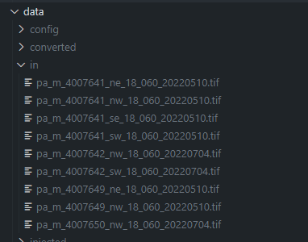

# kaiju-detector
The goal of this application is to show the ability to use geo-spatial imagery in a fun way from the Micrsoft Planetary Computer.  

# What does this application do?
The goal of this application is to identify and help Voltron to find the elusive kaiju of Godzilla and Mothra.  And to leverage and show how to use Microsoft's Planetary Computer and Custom Vision Service.  

# Why does this matter?
This is just a sample of how AI can be used to see things in Geospatial imagery.  This is meant for educational use only.  

# Pre-requisites:
The following are required to run this application:
- vscode - [download vscode](https://code.visualstudio.com/download)
- wsl - [install wsl](https://learn.microsoft.com/en-us/windows/wsl/install)

# Technologies being used:
The following are the key technologies being used by the kaiju detector:
- Planetary Computer
- Custom Vision

# Running the application.
The following steps will allow you to run this application code:

## Open the Dev Container:
This code makes use of a devcontainers, so first you will need to install the pre-requisites, and then you will need to hit "F1" on your keyboard and select the option for "Rebuild without cache and reopen devcontainer."  

Once your devcontainer is open, you will see the following:

## Build the container images:
Much like applications on orbit, or even on earth, this application makes use of docker containers for executing the different pieces.  To build the docker images, please run the following from your terminal:

```bash
bash ./scripts/build_images.sh
```

# Building our training data:
So the first part of this is to build our training data.  And to do that we need a lot of geospatial data.

## Get your bounding box:
So everything for geospatial imagery uses the same coordinate system as we've been using for almost one thousand years.  Latitude and Longitude.  

But to make this more fun, I have a script where you can give it an address and it will build the latitude and longitude bounding box for you.  The script is found [./scripts/get_bounding_box.sh](./scripts/get_bounding_box.sh):

First update line 2 to have the address in the United States you would like to see:
```bash
address="1 Innovation Way, Harrisburg, PA 17110"
```

And then save the changes.  Then run this command from a terminal in vscode:
```bash
bash ./scripts/get_bounding_box.sh
```

And you will get output like the following:
```shell
Getting lat/long and bounding box for...
Address: 1 Innovation Way, Harrisburg, PA 17110

Exact Lat / long:
Latitude: 40.2924986
Longitude: -76.88335361791044

Bounding Box:
Min Latitude: 40.2474986
Max Latitude: 40.3374986
Min Longitude: -76.93835361791044
Max Longitude: -76.82835361791044
Generating config file for bounding box at ./data/config...
File ./data/config/bbox.json deleted.
Generated config file for bounding box at ./data/config...
```

Now, this has already generated a file the application will use to run it through our Kaiju Injector / Detector.  That file can be found at [./data/config/bbox.json](./data/config/bbox.json).

If you want to update the file at [./config/bbox.json] you can migrate it over to the data directory with this script:
```bash
bash ./scripts/copy_config.sh
```

## Pulling Down imagery: - TODO - Remove docker
To pull down the imagery, you will run the following python file:

```bash
python3 ./src/get_imagery.py 
```

When completed, you will see the following in the data directory:



## Converting the image to PNG:
Now for us to use custom vision, it doesn't accept geotiffs, we need pngs, so let's run the following to conver them over.  

In our case we are going to use a tool called gdal_translate to accomplish this, by running the following command:
```bash
bash ./scripts/convert_images.sh ./data/in ./data/converted
```

When completed, you will see the output in the "./data/converted" directory:
## Resizing Images
So let's be honest, these images are huge, so let's run a quick script to shrink them down:
```bash
bash ./scripts/resize_images.sh ./data/converted ./data/resized
```
This will output into the ./data/resized directory

## Creating chips for training
For this we need a bunch of training data, so we're going to take the images and make chips out of them.  That can be done with this script:

```bash
bash ./script/chip_images.sh ./data/resized ./data/chipped
```
This will output into the ./data/chipped directory

## Running Kaiju Injection:
Now that we have the data, we need to get our kaiju, and you can do that by running the following commands:

```bash
python3 ./src/inject_kaiju.py
```

This will output into the ./data/injected directory and this is our training data.

## What is Custom Vision?
How that we have our training data, we can go about training our model.  Here's a video on how to do that.

[Getting Started with Custom Vision](https://www.youtube.com/watch?v=PnJlWXAjXDA)

You can repeat this process to train your model.  

## Running your custom vision model.
This is how you will run the custom vision model.  


# Running "For Real"
You can run the following commands to run "for real."
**NOTE: Switch the directories
```python
python3 ./src/get_imagery.py 
```
And then run the conversion:
```bash
bash ./scripts/convert_images.sh ./data/real-in ./data/real-converted
```
And then run the resize:
```bash
bash ./scripts/resize_images.sh ./data/real-converted ./data-real-resized
```
**NOTE:** Switch the directories
And then run the kaiju injection:
```python
python3 ./src/inject_kaiju.py 
```